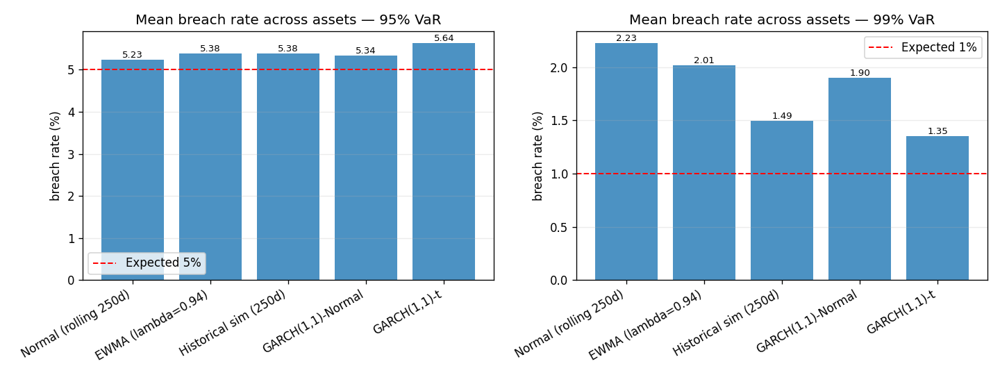
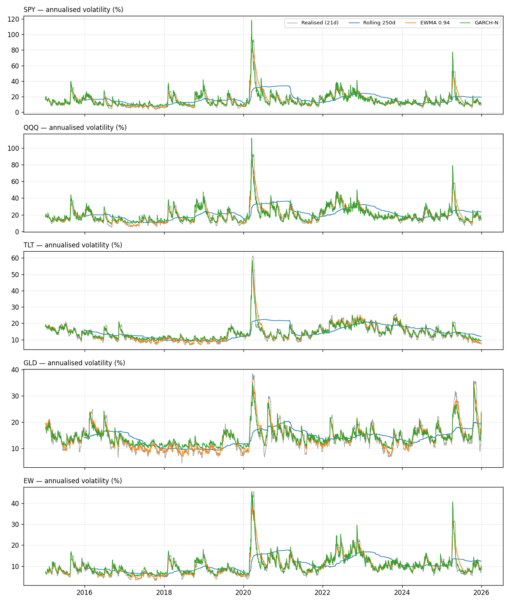
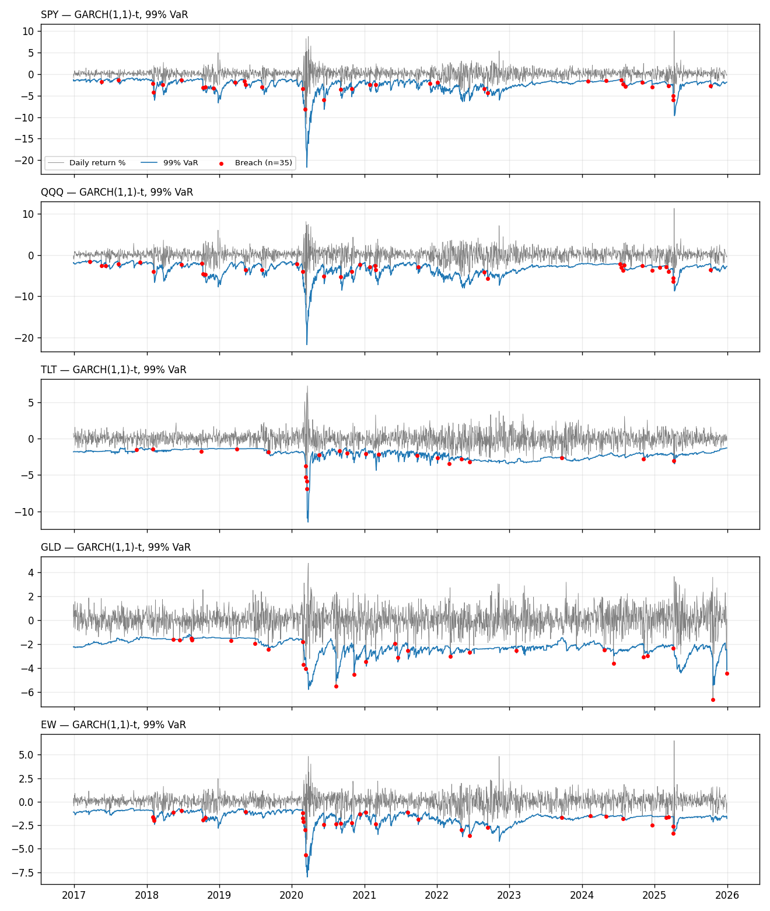
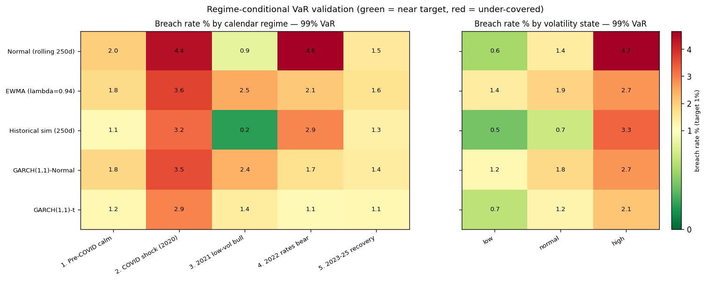

# Volatility Forecasting & Value-at-Risk Backtesting

A reproducible risk-analytics framework that forecasts daily volatility, computes
1-day **Value-at-Risk (VaR)** and **Expected Shortfall (ES)** under several models,
and **statistically validates** each model with regulatory-style backtests
(Kupiec, Christoffersen, Basel traffic-light).

> This is a **risk-measurement** project, not a trading strategy. There are no
> alpha claims, no P&L, no Sharpe ratios. The deliverable is an honest answer to
> one question a model-validation team actually asks: *does the VaR model hold up
> out-of-sample, and where does it break?*

---

## 1. Motivation

Banks are required to measure the potential loss on their trading books and to
**prove** those measurements are well-calibrated. A VaR model that looks
sophisticated but is quietly wrong is worse than a simple one that is honest
about its errors. The regulatory discipline — count the exceptions, run the
likelihood-ratio tests, colour-code the result — is the point of this project.

The central methodological commitment is **no look-ahead bias**: every VaR
forecast for day *t* is built using only information available through day *t-1*,
via a strict walk-forward loop. This is the single thing that separates a
credible backtest from a misleading one.

## 2. Data

* **Source:** Yahoo Finance via `yfinance` (daily adjusted close), cached to
  `data/prices.csv` so every run is reproducible without re-downloading.
* **Assets:** `SPY` (US equity), `QQQ` (tech/growth), `TLT` (long Treasuries),
  `GLD` (gold), plus an **equal-weight (EW)** daily-rebalanced portfolio of the
  four.
* **Period:** 2015-01-01 → 2025-12-31 → **2,764 daily log returns**
  (2015-01-05 → 2025-12-30). The window deliberately spans the **2020 COVID
  crash** and the **2022 rates sell-off** so the models are tested across
  volatility regimes, not just calm markets.
* **Returns:** daily log returns `r_t = ln(P_t / P_{t-1})`. The EW portfolio is
  built in simple-return space (equal-weight average) then converted to a log
  return, because log returns are not additive across assets.

## 3. Methodology

### Volatility models (increasing sophistication)

| # | Model | Description |
|---|-------|-------------|
| 1 | **Rolling std (250d)** | Sample standard deviation over a trailing 250-day window. The baseline. |
| 2 | **EWMA (λ = 0.94)** | RiskMetrics exponentially-weighted variance, `σ²_t = λσ²_{t-1} + (1-λ)r²_{t-1}`. |
| 3 | **GARCH(1,1)-Normal** | Conditional variance with volatility clustering, fit with the `arch` package. |
| 4 | **GARCH(1,1)-t** | Same dynamics, **Student-t innovations** to capture fat tails (the stretch goal). |

### VaR / ES estimation

* Horizon: **1 day**. Confidence levels: **95% and 99%**. ES (CVaR) at **97.5%**.
* Methods: parametric-normal (from rolling & EWMA σ), historical simulation
  (250-day empirical quantile), and GARCH-based parametric (normal & t).
* Convention: VaR is a **positive loss threshold**; a **breach** on day *t* is
  `return_t < −VaR_t`. Daily drift is set to zero (standard for a 1-day horizon).

### Walk-forward (no look-ahead)

At each day *t* the engine takes the trailing **500-day** window `[t-500, t-1]`,
produces the next-day σ / quantile from that block, and scores the forecast
against the **held-out** return on day *t*. All models share the same 2,264
out-of-sample evaluation days, so their statistics are directly comparable.

> **Performance note on GARCH.** Re-fitting GARCH every single day for 5 assets ×
> 2 distributions is ~20 min. Instead, GARCH **parameters** are re-estimated
> every **10 trading days**, while the **conditional-variance recursion is
> re-filtered every day** on the current window (via `arch`'s `fix()`), so the
> volatility forecast still updates daily and **no future information is used**.
> Set `--refit-every 1` for the fully-daily version.

### Backtests

* **Kupiec POF** — unconditional-coverage likelihood-ratio test (does the breach
  rate equal `1−confidence`?), `LR ~ χ²(1)`.
* **Christoffersen** — independence test (do breaches *cluster*?) and the
  combined conditional-coverage test, `LR_cc ~ χ²(2)`.
* **Basel traffic light** — green / yellow / red zones from exception counts in
  trailing 250-day windows at 99% VaR (green 0–4, yellow 5–9, red 10+).
* **Regime-conditional validation** — the same statistics re-run *within* each
  market regime (calendar-event and volatility-state partitions) and compared
  across all of them to measure **stability**, not just average calibration
  (see §4).

## 4. Results

**Headline: 99% VaR — the level regulation cares about** (2,264 out-of-sample
days per cell; expected exceptions ≈ 23, i.e. 1%). Full table for both
confidence levels: [`results/tables/summary.md`](results/tables/summary.md).

| Asset | Model | Exceptions | Breach % | Kupiec p | Kupiec | Basel |
|-------|-------|-----------:|---------:|---------:|:------:|:-----:|
| SPY | Normal (rolling) | 66 | 2.92% | 0.000 | FAIL | 🟡 |
| SPY | EWMA | 56 | 2.47% | 0.000 | FAIL | 🟡 |
| SPY | GARCH-Normal | 50 | 2.21% | 0.000 | FAIL | 🟡 |
| SPY | Historical sim | 40 | 1.77% | 0.001 | FAIL | 🟢 |
| SPY | **GARCH-t** | **35** | **1.55%** | **0.016** | FAIL | 🟢 |
| QQQ | Normal (rolling) | 67 | 2.96% | 0.000 | FAIL | 🟡 |
| QQQ | **GARCH-t** | **36** | **1.59%** | 0.009 | FAIL | 🟡 |
| TLT | Normal (rolling) | 28 | 1.24% | 0.275 | PASS | 🟢 |
| TLT | **GARCH-t** | **22** | **0.97%** | **0.892** | **PASS** | 🟢 |
| GLD | Normal (rolling) | 41 | 1.81% | 0.000 | FAIL | 🟡 |
| GLD | **GARCH-t** | **26** | **1.15%** | **0.488** | **PASS** | 🟢 |
| EW  | Normal (rolling) | 50 | 2.21% | 0.000 | FAIL | 🟡 |
| EW  | **GARCH-t** | **34** | **1.50%** | 0.026 | FAIL | 🟢 |

**Mean breach rate across all five assets** (dashed line = target):



At 99% the breach rate falls monotonically with model quality —
Normal **2.23%** → EWMA **2.01%** → GARCH-Normal **1.90%** → Historical **1.49%**
→ **GARCH-t 1.35%** (closest to the 1% target). At 95% every model is adequate
(~5%) and the extra sophistication doesn't help — the Student-t tail is actually
slightly *too* fat at 95% and marginally over-breaches.

**Two independent failure modes, and only one model handles both.** A good VaR
model must get *coverage* right (fat-enough tails) **and** *independence* right
(breaches shouldn't cluster in crises):

* **Coverage / fat tails (Kupiec).** Normal-tailed models (Normal-roll, EWMA,
  GARCH-Normal) systematically **under-estimate** 99% risk — breach rates of
  2–3%, mostly yellow Basel zones. The Student-t tail is what fixes the *level*.
* **Independence / clustering (Christoffersen).** **Historical simulation**
  achieves decent coverage (all-green traffic lights) but its static 250-day
  quantile reacts slowly, so its breaches **bunch together** in volatility spikes
  — it fails the independence test on 4 of 5 assets. The conditional-volatility
  models (EWMA, GARCH) adapt to regime shifts and produce **non-clustered**
  breaches.

**GARCH(1,1)-t is the only model that scores well on both** — the fat tail gives
it the closest-to-target coverage (0.97%–1.59%) *and* the volatility dynamics
keep its breaches from clustering. It earns the best traffic-light profile
(**4 green / 1 yellow** at 99%) and the only 🟢 on SPY among the parametric models.

**Conditional volatility vs. realised** and **VaR bands with breach days**:




Fitted GARCH(1,1)-t persistence `α+β` sits at 0.98–0.995 across assets
(near-integrated volatility) with tail `ν ≈ 5–6` for equities/gold and `ν ≈ 14`
for Treasuries — i.e. equities are meaningfully fatter-tailed than bonds, exactly
where the normal model fails hardest. Full parameters:
[`results/tables/garch_params.csv`](results/tables/garch_params.csv).

### Regime-conditional validation — is the model stable *everywhere*?

A single sample-wide breach rate can hide the truth: a model can look calibrated
on average while failing badly in a crisis. So the same backtest is re-run
**within** each of two regime partitions and compared across all of them
(`src/regimes.py`). This is the real stress test — and it is where the models
separate most clearly.

* **Calendar regimes** — pre-COVID calm, the 2020 COVID shock, the 2021 low-vol
  bull, the 2022 rate-hike bear, and the 2023–25 recovery.
* **Volatility-state regimes** — every day tagged `low` / `normal` / `high` by
  the terciles of its trailing 21-day realised vol (per asset). *Ex-post
  partition for analysis only — it never feeds the VaR, so no look-ahead.*



*Cell = mean breach rate (%) across the five assets; green = near the 1% target,
red = dangerously under-covered.* The pattern is stark:

* **The normal model collapses in stress.** Rolling-Normal breaches **4.4%** in
  the COVID shock and **4.6%** in the 2022 bear (vs a 1% target), and hits
  **6.8%** in its worst single cell (equal-weight book, 2022 — when stocks *and*
  bonds fell together and "diversification" failed). In the `high` volatility
  state it breaches **4.7%** — a ~5× under-coverage exactly when capital matters.
* **GARCH-t degrades gracefully.** Its worst regime is the COVID shock at
  **2.9%** and its worst single cell is **4.6%** — roughly *half* the normal
  model's worst case — while staying at 1.1–1.6% in every calm regime. In the
  `high` vol state it holds **2.1%**, the best of any model.
* **Historical simulation is deceptive.** Great in calm/low-vol regimes (0.2–0.7%)
  but jumps to **3.3%** in the high-vol state — its static window is slow to
  react, so its risk is worst precisely when it is needed (this is the same
  weakness the Christoffersen test flags as breach clustering).

**Stability leaderboard** (99% VaR; lower = more stable; full table
[`results/tables/regime_stability_99.csv`](results/tables/regime_stability_99.csv)):

| Model | Worst-regime rate | Regime spread (max−min) | Worst single cell |
|-------|------------------:|------------------------:|------------------:|
| **GARCH(1,1)-t** | **2.91%** | **1.79** | **4.55%** |
| Historical sim | 3.18% | 2.94 | 3.98% |
| GARCH-Normal | 3.55% | 2.13 | 5.45% |
| EWMA | 3.64% | 2.01 | 5.45% |
| Normal (rolling) | 4.62% | 3.75 | 6.77% |

GARCH-t has both the **lowest worst-regime breach rate** and the **tightest
spread across regimes** — it is the most stable model, not just the best on
average. Per-regime detail (n, mean return, annualised vol, worst day, breaches,
Kupiec p) is in
[`results/tables/regime_calendar_99.csv`](results/tables/regime_calendar_99.csv)
and [`regime_volstate_99.csv`](results/tables/regime_volstate_99.csv).

### Which model won?

**At 99% VaR, GARCH(1,1) with Student-t innovations** — it roughly **halves** the
exceedance rate of the normal-tailed models (e.g. SPY 1.55% vs 2.92%), is the
only model combining a fat-enough tail with volatility adaptivity (best Basel
traffic-light record), **and is the most stable across regimes** (lowest
worst-regime rate, tightest cross-regime spread). **Honest caveat:** even GARCH-t
still over-breaches in the tails — ~1.55–1.59% on the equity indices overall, and
up to 2.9% in the COVID shock — and only formally passes Kupiec on the calmer
assets (TLT, GLD). No single-horizon model fully tames 2020/2022 equity tail risk;
what GARCH-t buys you is a *graceful* failure instead of a catastrophic one.

## 5. Limitations

* **Normal-tail underestimation is structural, not incidental.** The normal
  models fail 99% coverage by construction; this is demonstrated, not hidden.
* **Parameter instability / regime dependence.** GARCH parameters are
  re-estimated only every 10 days and treated as locally constant; near-integrated
  `α+β ≈ 1` estimates are sensitive to the estimation window. The regime analysis
  makes this concrete — *every* model's breach rate rises sharply in the `high`
  volatility state, so calibration is regime-dependent, not universal.
* **Single horizon.** Only 1-day VaR is tested; no square-root-of-time scaling or
  10-day regulatory horizon.
* **Equity tail risk remains under-covered** even by the best model — an honest
  negative result, not a solved problem.
* **Gaussian/t parametric ES** inherits the same distributional assumptions as
  the VaR; ES is reported but not separately backtested (harder to backtest).
* **Data vendor.** Yahoo adjusted closes are not survivorship- or
  corporate-action-audited to institutional standards.

## 6. Reproducing everything

```bash
pip install -r requirements.txt

python run_analysis.py          # full run (all models); regenerates every table & figure
python run_analysis.py --quick  # fast smoke run, skips the two GARCH models

pytest -q                       # unit tests: known-input VaR/ES, Kupiec & Christoffersen on synthetic breaches
```

Outputs land in `results/tables/` (CSV + Markdown) and `results/figures/` (PNG).
The walk-forward panel is cached to `results/walkforward.pkl`; the narrative
notebook is [`notebooks/analysis.ipynb`](notebooks/analysis.ipynb). All randomness
is seeded (`SEED = 42`); market data is cached for bit-for-bit reproducibility.

### Repository layout

```
volatility-var-backtesting/
├── README.md
├── requirements.txt
├── run_analysis.py            # one command -> all figures + tables
├── data/                      # cached prices.csv
├── src/
│   ├── data.py                # download + returns + caching
│   ├── volatility.py          # rolling, EWMA, GARCH wrappers
│   ├── var.py                 # VaR/ES calculators + walk-forward engine
│   ├── backtest.py            # exceedances, Kupiec, Christoffersen, traffic light
│   └── regimes.py             # regime partitions + per-regime backtest + stability
├── notebooks/analysis.ipynb   # narrative walkthrough (imports src/)
├── results/figures/  tables/
└── tests/                     # test_var.py, test_regimes.py
```

## 7. References

* Kupiec, P. (1995). *Techniques for Verifying the Accuracy of Risk Measurement
  Models.* Journal of Derivatives.
* Christoffersen, P. (1998). *Evaluating Interval Forecasts.* International
  Economic Review.
* J.P. Morgan / Reuters (1996). *RiskMetrics — Technical Document* (EWMA, λ=0.94).
* Bollerslev, T. (1986). *Generalized Autoregressive Conditional
  Heteroskedasticity.* Journal of Econometrics.
* Basel Committee on Banking Supervision (1996). *Supervisory Framework for the
  Use of "Backtesting"* (traffic-light approach).
* Sheppard, K. *`arch` — ARCH/GARCH models in Python.*
